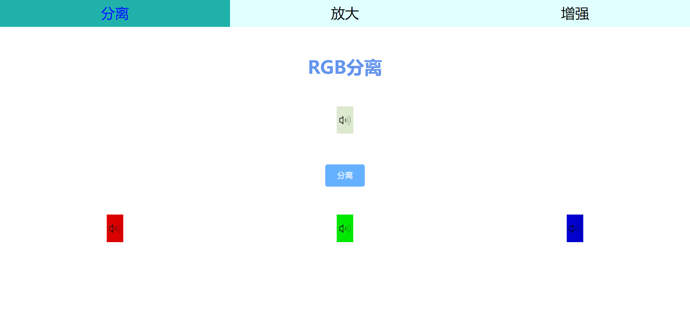
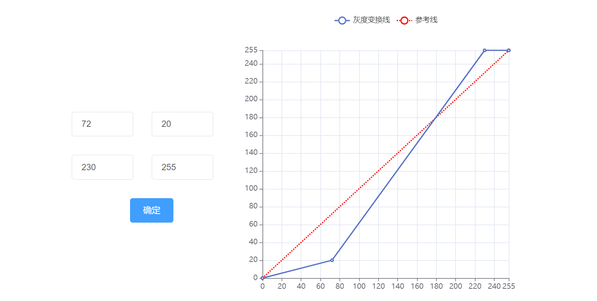
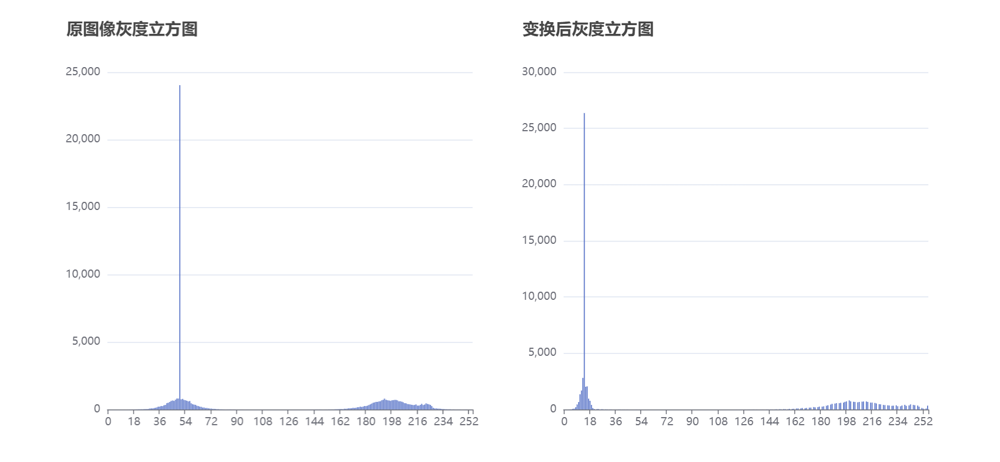

# 多媒体三次作业整合
+ [RGB分离](#RGB分离)
+ [图像放大](#图像放大)
+ [图像线性灰度变换](#图像线性灰度变换)
***
## RGB分离

***
## 图像放大


***
## 图像线性灰度变换






***
## 项目安装
```
npm install
```

### 编译和热部署
```
npm run serve
```

### 构建
```
npm run build
```
